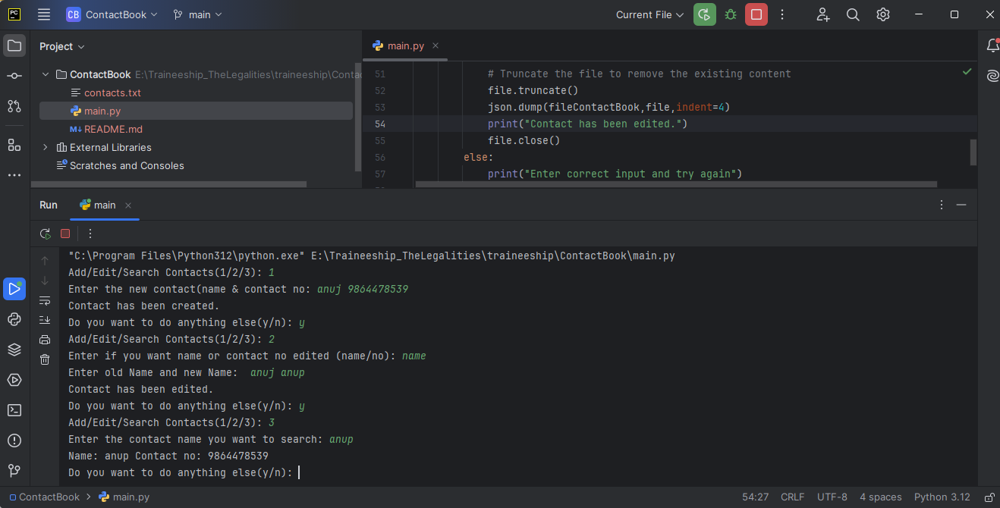

Contact Book CLI
Description
This is a simple command-line contact book application written in Python. It allows users to add, edit, and search for contacts. Contacts are stored in a JSON file (contacts.txt). Users can perform operations to manage their contact list through a menu-driven interface.

Installation
Follow these steps to set up and run the project locally:

Clone the repository:
git clone https://github.com/Anujrajthala/traineeship.git

Navigate to the project directory:
cd ContactBook

Run the Python script:
python main.py

If Python is not installed globally, you might need to use python3 instead of python:
python3 main.py

Usage
When you run the script, you will be prompted with a menu to choose an action:

Add/Edit Contact:

Enter 1 to add a new contact or edit an existing one.
For adding, provide the contact name and number.
For editing, choose whether to edit the contact name or number and provide the relevant details.
Edit Contact:

Enter 2 to edit an existing contact.
Choose whether you want to edit the name or contact number.
Provide the necessary details to update the contact.
Search Contact:

Enter 3 to search for a contact by name.
Enter the name of the contact you want to find.
Exit:

After performing an operation, you will be asked if you want to do anything else.
Enter n to exit the program.
Example

Adding a New Contact:
Add/Edit/Search Contacts (1/2/3): 1
Enter the new contact (name & contact no): John 1234567890
Contact has been created.

Editing a Contact:
Add/Edit/Search Contacts (1/2/3): 2
Enter if you want to edit name or contact no (name/no): name
Enter old Name and new Name: John Johnny
Contact has been edited.

Searching for a Contact:

Add/Edit/Search Contacts (1/2/3): 3
Enter the contact name you want to search: Johnny
Name: Johnny Contact no: 1234567890

Features
Add new contacts with name and contact number.
Edit existing contacts by updating the name or contact number.
Search for contacts by name.

Screenshot

Known Issues
Ensure to provide both name and contact number when adding or editing contacts to avoid errors.
Make sure to enter valid data to avoid incorrect entries or errors.

Technologies Used
Python
JSON

