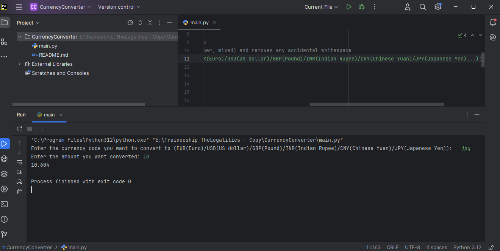

Currency Conversion Script

Description:
This Python script allows users to convert an amount from Nepalese Rupees (NPR) to various international currencies using the ExchangeRate API. The supported currencies include Euro (EUR), US Dollar (USD), British Pound (GBP), Indian Rupee (INR), Chinese Yuan (CNY), and Japanese Yen (JPY). The user inputs the desired target currency and amount, and the script fetches the conversion result from the API.

Installation:
Clone the repository or download the script:
git clone https://github.com/Anujrajthala/traineeship.git

Navigate to the directory:
cd currency-conversion-script

Install required Python packages:
Ensure you have Python installed on your machine. You can install the required packages using pip:
pip install requests

Usage
Run the script:
python main.py

Follow the prompts:

Enter the currency code you want to convert to (e.g., EUR, USD, GBP, INR, CNY, JPY).
Enter the amount you want to convert.
View the conversion result:

The script will display the converted amount if the API request is successful, or an error message if something goes wrong.

Example
Enter the currency code you want to convert to(EUR(Euro)/USD(US dollar)/GBP(Pound)/INR(Indian Rupee)/CNY(Chinese Yuan)/JPY(Japanese Yen)): USD
Enter the amount you want converted: 1000
The converted amount is: 8.41

Screenshot

Features:
Converts NPR to various international currencies.
Uses real-time exchange rates from the ExchangeRate API.
Simple and user-friendly command-line interface.

Known Issues:
The script assumes that the user inputs a valid currency code and amount. No validation is performed on the input.
Error handling is basic and may not cover all potential issues, such as network failures or API downtime.

Technologies Used:
Python: Programming language used to write the script.
Requests Library: For making HTTP requests to the ExchangeRate API.

