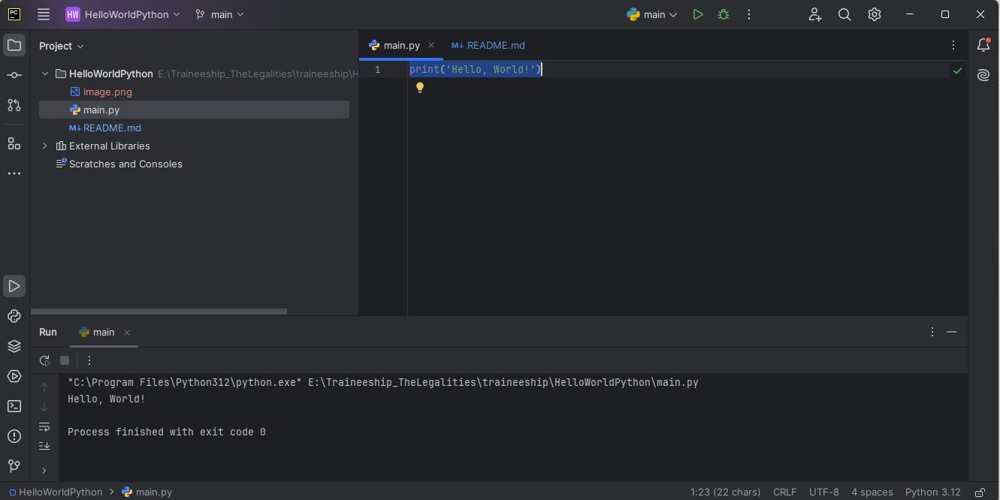

Hello World Python Project
Description
This is a simple Python project that prints "Hello, World!" to the console. It's a classic example often used to demonstrate the basic syntax of a programming language.

Installation
Follow these steps to run the project locally:

Clone the repository:
git clone https://github.com/Anujrajthala/traineeship.git

Navigate to the project directory:
cd HelloWorldPython

Run the Python script:
python main.py

If Python is not installed globally, you might need to use python3 instead of python:
python3 main.py

Usage
When you run the script, it will output the following message to the console:
Hello, World!

Screenshot

Features
Basic Python script demonstrating how to print text to the console.
Perfect for beginners learning Python.

Technologies Used
Python