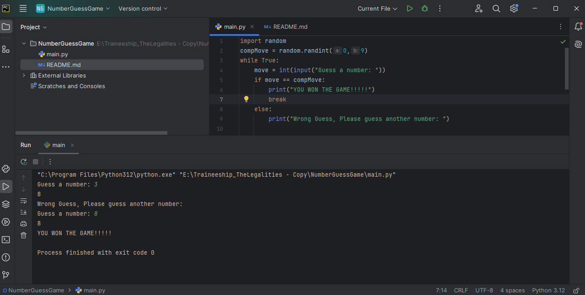

# Number Guessing Game
## Description
A simple number guessing game where the player tries to guess a randomly generated number between 0 and 9. The game continues until the player correctly guesses the number.

## Installation
Clone the repository:
https://github.com/Anujrajthala/traineeship.git

Navigate to the project directory:
cd RPSGame

Run the Python script:
python main.py

If Python is not installed globally, you might need to use python3 instead of python:
python3 main.py

## Usage
Run the script using Python.
Enter your guess when prompted to "Guess a number:".
Continue guessing until you correctly guess the randomly generated number.
Once you guess correctly, the script will print "YOU WON THE GAME!!!!!" and exit.

## Example
$ python number_guessing_game.py
Guess a number: 4
Wrong Guess, Please guess another number:
Guess a number: 7
YOU WON THE GAME!!!!!

## Screenshot
(Include a screenshot here if applicable)

## Features
Randomly generates a number between 0 and 9.
Continues to prompt the user until the correct number is guessed.
Provides feedback on each guess.

## Known Issues
None.

## Technologies Used
Python

## Screenshot
