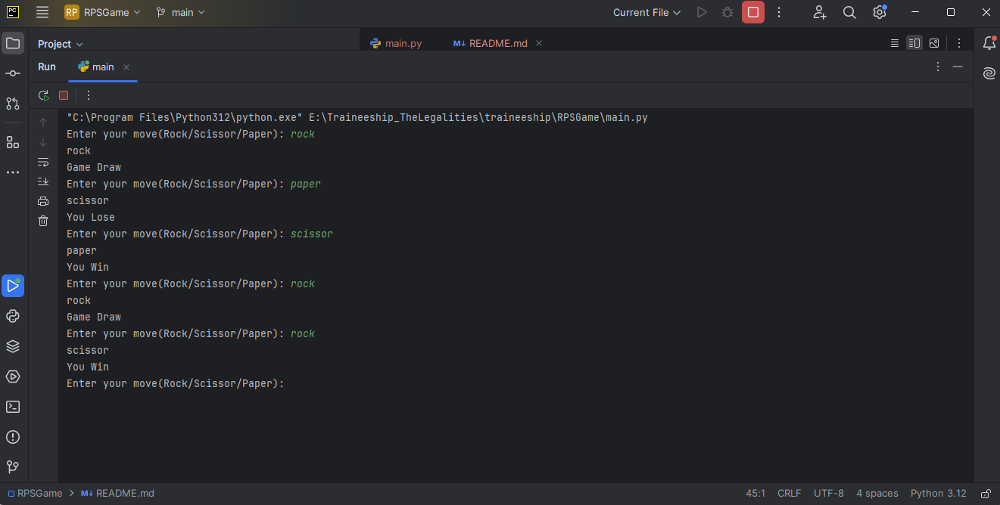

Rock-Paper-Scissors Game
Description
This is a simple command-line Rock-Paper-Scissors game written in Python. The user plays against the computer, which randomly selects a move. The game will continue running until the user chooses to exit.

Installation
Follow these steps to set up and run the project locally:

Clone the repository:
https://github.com/Anujrajthala/traineeship.git

Navigate to the project directory:
cd RPSGame

Run the Python script:
python main.py

If Python is not installed globally, you might need to use python3 instead of python:
python3 main.py

Usage
When you run the script, the game will prompt you to enter your move:

Enter your move (Rock/Scissor/Paper): 
Choose your move: Enter either Rock, Paper, or Scissor. The input is case-insensitive.
Computer's move: The computer will randomly choose its move.
View the result: The game will display whether you won, lost, or if it's a draw.
To exit the game: Type exit when prompted to enter your move.
Example
Enter your move (Rock/Scissor/Paper): rock
scissor
You Win

Enter your move (Rock/Scissor/Paper): paper
rock
You Win

Enter your move (Rock/Scissor/Paper): exit

Screenshot

Features
Play against the computer.
Simple text-based interface.
Continuous play until the user opts to exit.

Known Issues
None known at the moment.

Technologies Used
Python
