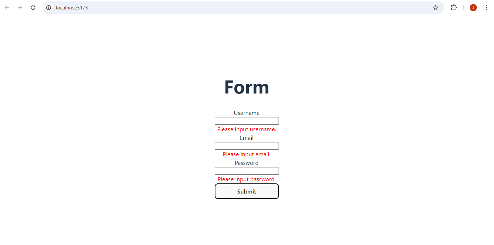
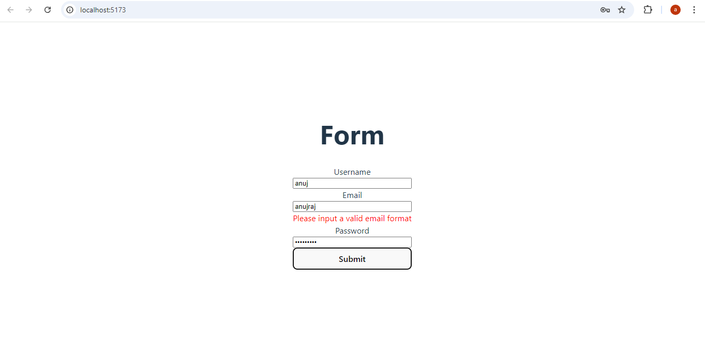
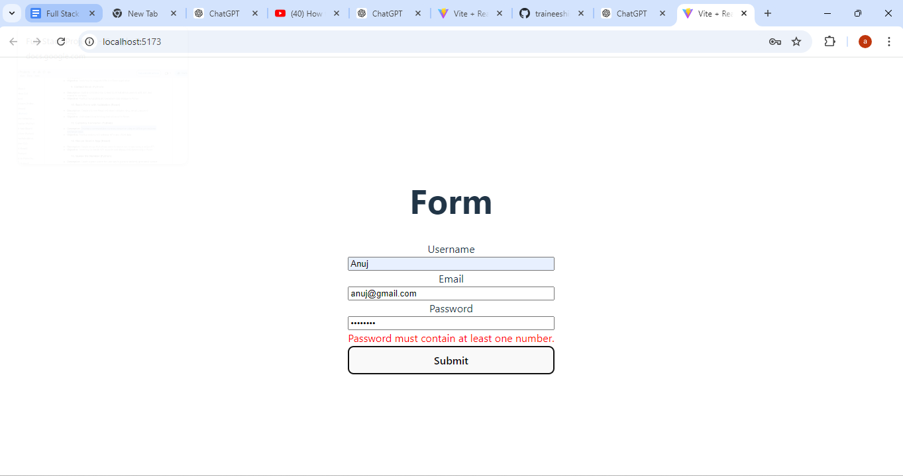
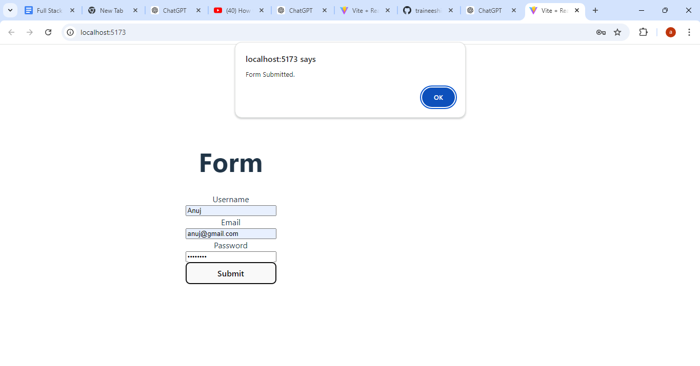

React Form Validation

Description:
This is a simple React application that features a form with validation for username, email, and password. The app provides basic validation rules to ensure that users enter the required information correctly before submitting the form. It includes checks for valid email formats, password complexity, and non-empty fields.

Installation:
Follow these steps to set up and run the project locally:

Clone the repository:
git clone https://github.com/Anujrajthala/traineeship.git

Navigate to the project directory: cd form-validation

Install the dependencies:
npm install

Run the React application:
npm run dev

If npm run dev doesn't work, you might need to use npm start:
npm start

Usage
When you run the application, you will see a form with input fields for username, email, and password, along with a submit button:

Enter Username: Fill in the username field. It cannot be empty.

Enter Email: Fill in the email field. It must follow a valid email format (e.g., example@example.com).

Enter Password: Fill in the password field. The password must meet the following criteria:

At least 5 characters long.
Contains at least one uppercase letter.
Contains at least one lowercase letter.
Contains at least one number.
Contains at least one special character.
Submit the Form: Click the "Submit" button. If there are validation errors, they will be displayed next to the corresponding input fields. If all inputs are valid, an alert will notify you that the form has been successfully submitted.

Example
Enter new task:

Username: JohnDoe
Email: john.doe@example.com
Password: P@ssw0rd
[Submit]

Validation Errors:

Username: (empty)
Email: Invalid email format
Password: (fails to meet criteria)

Screenshot:

Features:
Form validation for username, email, and password.
Displays error messages next to the fields if validation fails.
Alerts the user upon successful form submission if there are no errors.
Known Issues
No known issues at the moment.
Technologies Used
React
JavaScript
CSS

