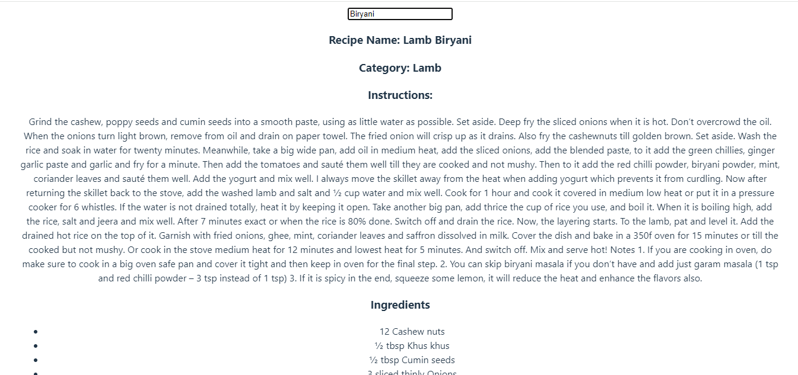
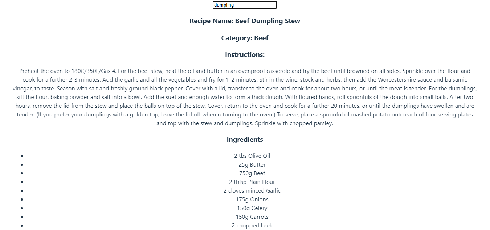

# Recipe App

## Description
This is a React application that allows users to search for recipes by entering a dish name. The app fetches recipe data from the MealDB API and displays the recipe details along with a list of ingredients.

## Installation

To set up the project on your local machine, follow these steps:

### Clone the repository:
git clone https://github.com/Anujrajthala/traineeship.git

### Navigate to the project directory:
cd recipe-search-app

### Install the required dependencies:
npm install

## Usage
### Start the development server:
* npm start
* Open your web browser and go to http://localhost:5174.

Enter the name of a dish into the input field

The app will display the recipe name, category, instructions, and a list of ingredients.

## Example
Here is an example of how the application might look:

## Screenshots

## Features
1. Search for recipes by dish name
2. Display recipe name, category, and instructions
3. List of ingredients with measurements

## Known Issues
1. Recipe data may not be available for all dish names
2. Network issues may affect data fetching

## Technologies Used
1. React
2. Axios
3. CSS
