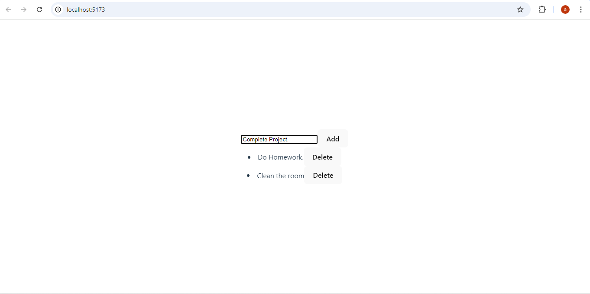
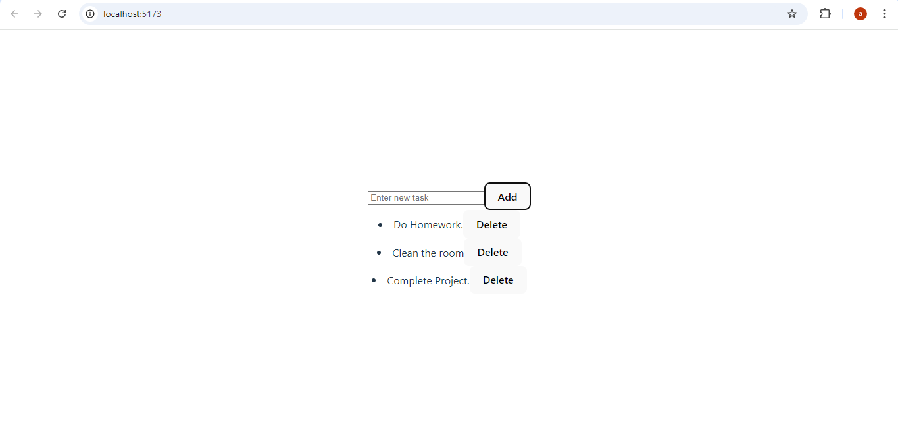
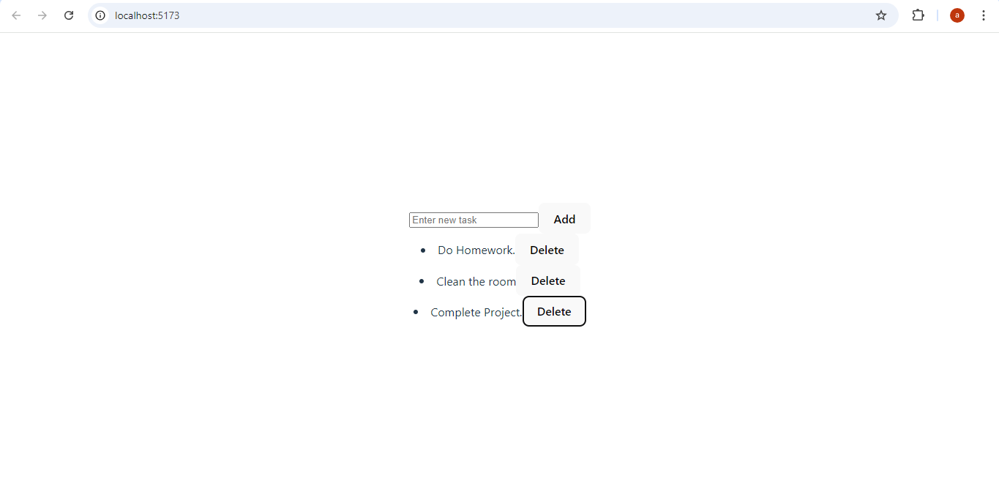
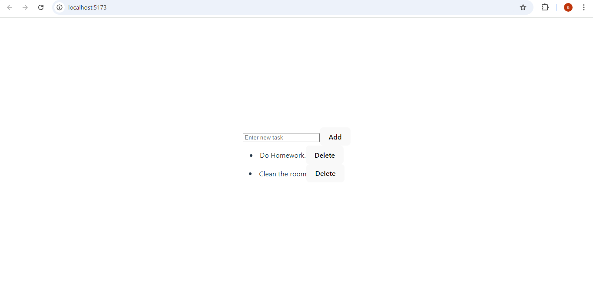

React To-Do List Application

Description
This is a simple To-Do List application built using React. The app allows users to add tasks to a list and delete them as needed. It features a basic user interface with an input field for entering tasks and a list that displays the tasks along with a delete button for each task.

Installation
Follow these steps to set up and run the project locally:

Clone the repository:
git clone https://github.com/Anujrajthala/traineeship.git

Navigate to the project directory:
cd to-do-list

Install the dependencies:
npm install

Run the React application:
npm run dev

If npm run dev doesn't work, you might need to use npm start:
npm start

Usage
When you run the application, you will see an input field and a button:

Add a task: Enter a task in the input field and click the "Add" button. The task will be added to the list below.
Delete a task: Each task in the list has a "Delete" button. Click this button to remove the task from the list.
Example
Enter new task: Learn React
[Add] 

- Learn React [Delete]
Screenshot
Adding Tasks:

Deleting tasks:

Features
Add tasks to the list.
Delete tasks from the list.
The application continues running, allowing for multiple tasks to be added or deleted.
Known Issues
No known issues at the moment.
Technologies Used
React
JavaScript
CSS

