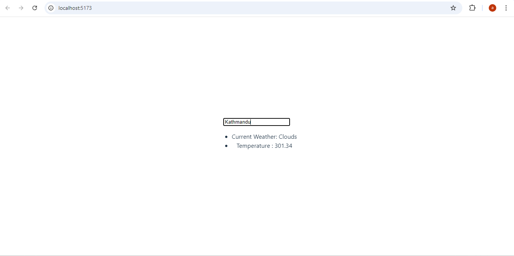
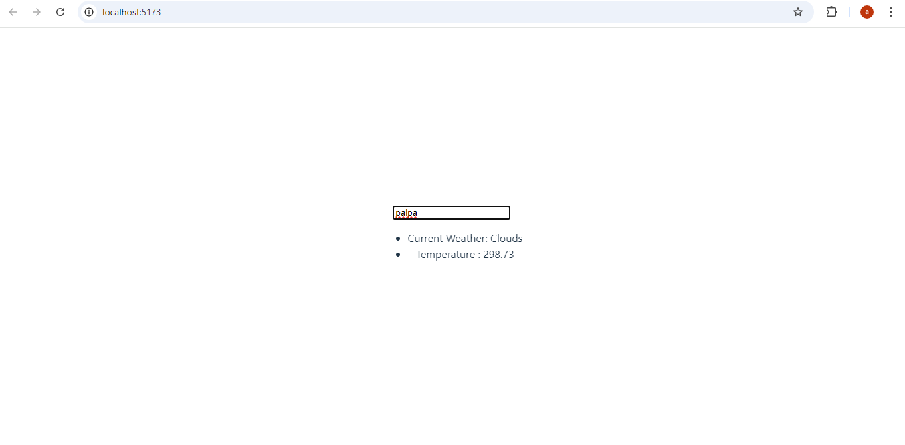

Weather Application

Project Description
This project is a simple React application that allows users to search for a location and view the current weather for that location. The app leverages the OpenWeatherMap API to fetch weather data based on the user's input. The primary goal of this project is to demonstrate the use of React components, useState, useEffect hooks, and API integration using axios.

Project Features
Location Input: Users can input a location to search for weather data.
Weather Display: Displays the current weather and temperature for the searched location.
API Integration: Uses OpenWeatherMap API to fetch location coordinates and weather data.

Component Description
App.js
This is the main entry point of the application. It imports and renders the SetLocation component.

SetLocation.js
This component handles the input of the location and fetches the location data (latitude and longitude) using the OpenWeatherMap Geocoding API. It passes the fetched data to the DisplayWeather component.

DisplayWeather.js
This component receives location data from SetLocation and fetches the current weather data for that location using the OpenWeatherMap Weather API. It then displays the weather information, such as the current weather condition and temperature.

API Reference
Geocoding API: http://api.openweathermap.org/geo/1.0/direct?q={location},np&limit=1&appid={apiKey}
Fetches the latitude and longitude of a given location.
Weather API: https://api.openweathermap.org/data/2.5/weather?lat={lat}&lon={lon}&appid={apiKey}
Fetches the weather data for the specified latitude and longitude.

Installation Instructions

Clone the repository:
git clone https://github.com/yourusername/weather-app.git

Navigate to the project directory:
cd weather-app

Install dependencies:
npm install

Start the development server:
npm run dev

Usage
Open the application in your browser.
Enter a location in the input field.
The current weather and temperature for the specified location will be displayed.

Example Usage
Open the application.
Type "Kathmandu" into the input field.
The app will display the current weather and temperature in Kathmandu.

Screenshots

Known Issues
The application currently supports fetching data for a single location only.
Error handling for invalid locations could be improved.
The weather data may take a few seconds to load due to API response time.

